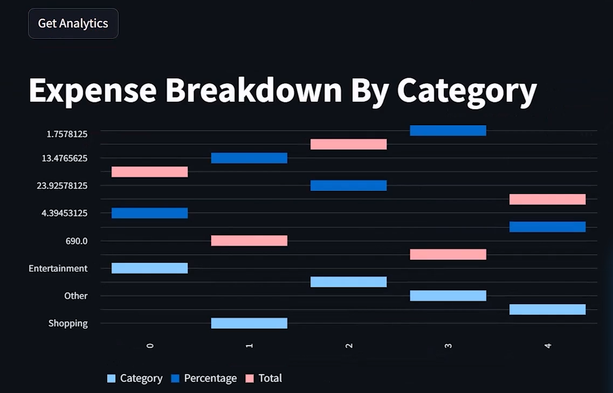

# 💸 Expense Management System

A full-stack expense management application built with **Streamlit** and **FastAPI**, designed to help users track, manage, and monitor their expenses efficiently.

> Developed by [KenuraRansidu](https://github.com/KenuraRansidu)

---

## 📌 Overview

The Expense Management System provides a clean and intuitive interface for managing personal or organizational expenses. The frontend is powered by Streamlit for rapid, interactive UI, while the backend leverages FastAPI to deliver a fast and reliable REST API.

---

## 📁 Project Structure

```
expense-management-system/
├── frontend/         # Streamlit application
├── backend/          # FastAPI backend server
├── tests/            # Unit and integration tests
├── requirements.txt  # Python dependencies
└── README.md         # Project documentation
```

---

## 📸 Screenshots

### Add / Update Expenses

> Add daily expenses with amount, category, and notes — all in one clean form.

### Analytics — Category Breakdown (Bar Chart)

> Visual bar chart showing expense breakdown by category with percentage and total.

### Analytics — Detailed Category View

> Detailed multi-axis analytics view showing category, percentage, and total comparisons.

---

## ⚙️ Setup Instructions

### 1. Clone the Repository

```bash
git clone https://github.com/KenuraRansidu/expense-management-system.git
cd expense-management-system
```

### 2. Install Dependencies

```bash
pip install -r requirements.txt
```

### 3. Run the FastAPI Backend

```bash
uvicorn server.server:app --reload
```

### 4. Run the Streamlit Frontend

```bash
streamlit run frontend/app.py
```

---

## 🚀 Features

- 📊 View and manage expenses through an interactive dashboard
- ➕ Add, update, and delete expense records
- 🔍 Filter and search expenses by category or date
- ⚡ Fast REST API powered by FastAPI
- 🖥️ Responsive UI built with Streamlit

---

## 🧪 Running Tests

```bash
pytest tests/
```

---

## 👤 Author

**KenuraRansidu**
- GitHub: [@KenuraRansidu](https://github.com/KenuraRansidu)
